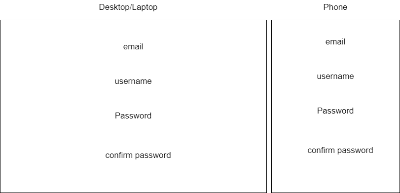
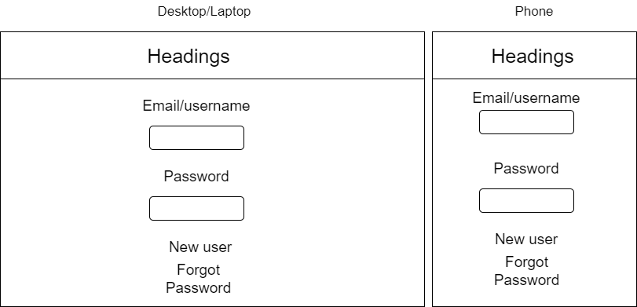
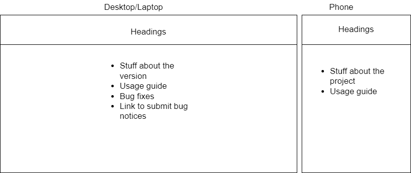
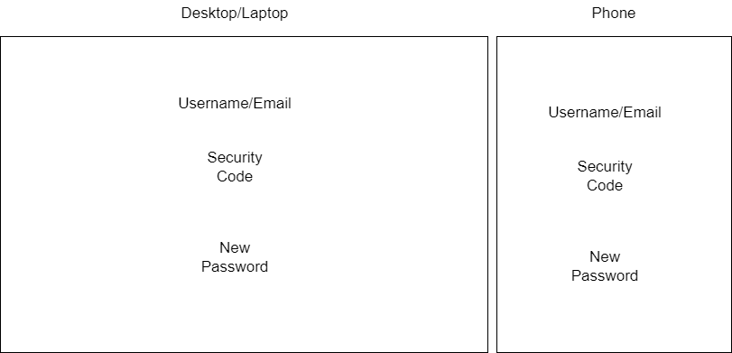
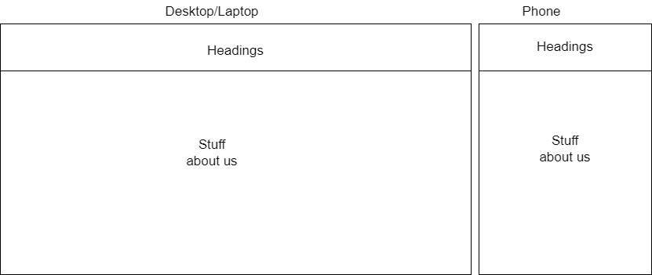
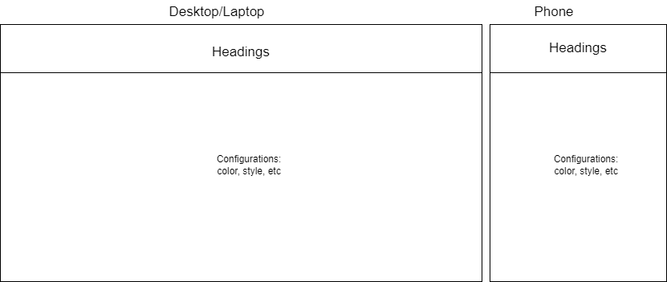
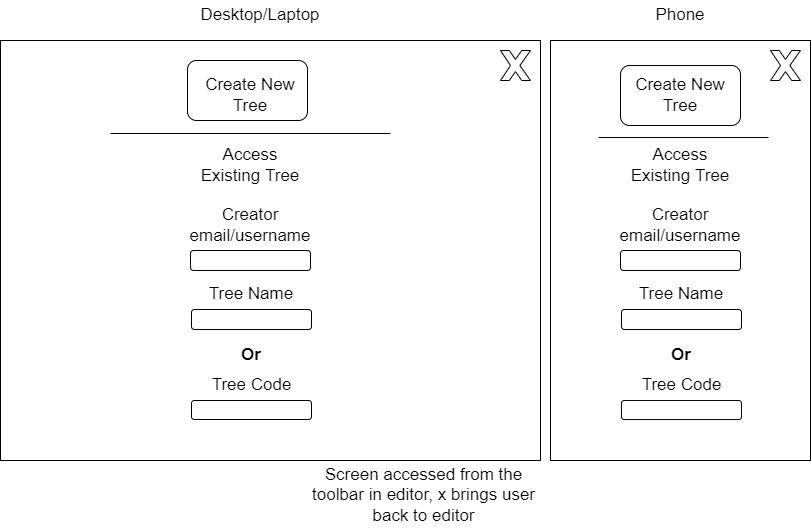
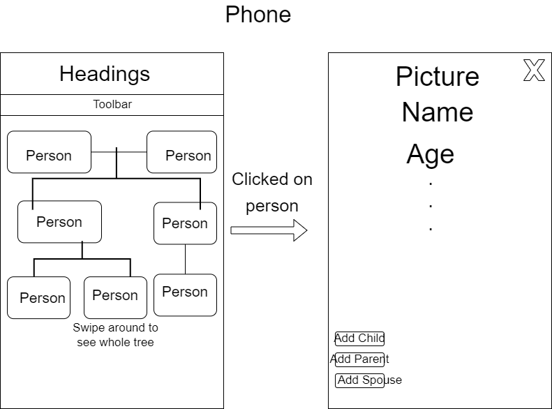
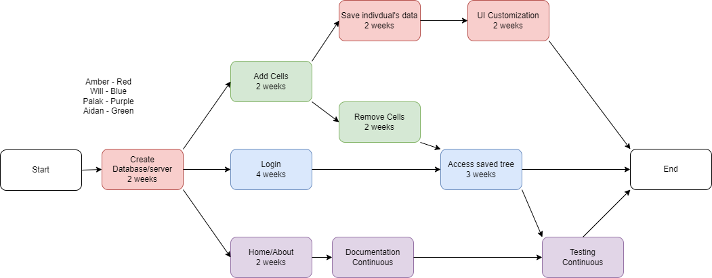

Software Development Plan
==================================

FamilyFrame

Nov 3, 2023

Version 1.0.0

**Presented To:**

Dr. Schwesinger

**Submitted By:**

Amber, Aidan, Will, Palak

REVISION HISTORY
----------------

  **Date**       |**Author**   |**Distributed to**   |**Version**          |**Description**
  -------------- | ------------ |-------------------- |-------------------- |-----------------------------
  Nov 3, 2023  | Aidan La Penta | Dr. Schwesinger | 1.0.0 | Creation

\newpage

TABLE OF CONTENTS
-----------------
1. [Product Description](#1-product-description)
2. [Team Description](#2-team-description)
3. [Software Process Model Description](#3-software-process-model-description)
4. [product Definition](#4-product-definition)
5. [User Experience Wireframes](#5-user-experience-wireframes)
6. [Project Organization](#6-project-organization)
7. [Validation Plan](#7-validation-plan)
8. [Feasibility Study](#8-feasibility-study)
9. [Configuration and Version Control](#9-configuration-and-version-control)
10. [Tools](#10-tools)
11. [Architecture](#11-architecture)

\newpage

1\. Product Description
----------------------
The family tree website offers a extensive way for one to view their family’s ancestry and relation, 
organize information about their family, and view it in a way to suit their tastes.

Clients can consist of those looking to
1.	View their ancestry in an organized manner
2.	Easier way to display/share their familial connections to possibly show others

Functionalities:

- Show the entire family that one inputs, and their branches
- Be able to store names, photos, and relation between members
- Sharing trees (w/ use of an image)
- Show a member’s information in one place
- (Possibly color accents)

2\. Team Description
-------------------

Describe the strengths/skills needed of the team members for this
product. Use a table to list skills vs team members.
  **Skill**       |**Amber**   |**Aidan**   |**Palak**          |**Will**
  -------------- | ------------ |-------------------- |-------------------- |-----------------------------
  Javascript  |  | y | |
  Learning languages | y | y | y | y
  HTML |  | y |  | y
  CSS |  | y |  | y
  Server Maintenance |  |  |  | 
  Database | y | y | y | y
  Security |  |  |  | 
  Markdown |  |  |  | y
  

Is there a need for a Subject Matter Expert (SME)?
No

What expertise is missing?
Database knowledge

3\. Software Process Model Description
-------------------------------------

The agile methodology will be used for this project. Agile allows for more flexible development and will respond to changing requirements as development progresses. We will take a variety of ideas from different agile methodologies, like sprints from scrum and the simplicity in Extreme Programming. Our project can be broken into independent features that are tackled concurrently each sprint. Features can then be integrated by the end of each sprint, similar to the incremental model. We will also be aware of our progress at the end of each sprint and have more accountability for deadlines. Solutions will be simple and understandable by other members to aid in integration.

However, Agile can also lead to burnout if there is not sufficient post-sprint review and unwinding. The short nature of sprints may also encourage development of small, non-critical features. This will be remedied by following the requirements traceability matrix. Documentation may suffer due to the fast pace. Not enough time might be spent for retrospection and could lead to problems later in development. Features may be designed too quickly and inelegantly which will put us into code debt.

The waterfall methodology ensures that components are complete and can be built upon but is inflexible for changing requirements which is likely in a senior project. Waterfall projects are easiliy tracked but Agile meetings following each sprint provides the same accountability. The rational unified process and spiral model methods are similarly built on a foundation of design that will be unstable for this project.

4\. Product Definition
---------------------

The application will support normal users and admins. Normal users can use the application with or without an account. A normal account can be created by any user. An initial admin account will be created for development and can create other admin accounts. 

Relationship information will be gathered from the normal users who create family trees. Family information will be collected and the application will visualize the information. The family tree will be stored in the application database to view later, export to other formats, or share to other users. Administrators can view a user list and the trees the users have created. 

## Use Case Descriptions

### 4.1 Add a tree
1. Name: CreateTree
2. Actor: User
3. Entry condition: Tree editor page (homepage) is open
4. Exit condition: Tree is created and, if the user is optionally logged in, saved
5. Flow of events
    1. User adds self
    1. User adds desired relatives
    1. Application visualizes connections
    1. User adds desired information to each relative
    1. Application stores data attributes
6. Special requirements:
    - 3a: incorrect connections can be removed

### 4.2 Share a tree
1. Name: ShareTree
2. Actors: >=2 users
3. Entry condition: A tree is created and saved to one user
4. Exit condition: >=2 users have access to the tree
5. Flow of events
    1. User navigates to the tree to share
    1. User clicks on share
    1. Application shows tree's UUID
    1. User shares the UUID
6. Special requirements: None

### 4.3 Delete a tree
1. Name: DeleteTree
2. Actor: User
3. Entry condition: A tree is created and saved to one user
4. Exit condition: The tree is removed from the user account and the database
5. Flow of events
    1. User navigates to the tree to remove
    1. User clicks on delete
    1. Application removes the tree from the database
    1. User page of list of trees is updated
6. Special requirements: 

### 4.4 Create account
1. Name: Create account
2. Actor: User 
3. Entry condition: User is not logged in
4. Exit condition: User has an account on the site
5. Flow of events:
    1. User navigates to login page
    1. User selects "Create account"
    1. User registers an email address and password
    1. Database securely stores user's credentials
    1. User is taken to login page
6. Special Requirements
    - 4a: Entering an already-registered email throws an error and stays on the account creation page

### 4.5 Log in
1. Name: Log in
2. Actor: User, admin
3. Entry condition: Person has an account
4. Exit condition: Person is logged in to the site
5. Flow of events:
    1. Person (normal user or admin) navigates to the login page.
    1. Person enters login credentials. 
    1. Website authenticates user against a user list in the database.
    1. User is logged in an starts a session.
6. Special Requirements

### 4.6 Delete self
1. Name: Delete user
2. Actor: User
3. Entry condition: User has an account and is logged in
4. Exit condition: User's account and trees are deleted, shared trees remain
5. Flow of events:
    1. User navigates to the manage account page and selects delete account.
    1. User chooses to leave trees that have collaborators and selects a new owner.
    1. Website logs the user out and deletes user information from the database.
    1. User is returned to the tree creation page in a temporary session.
6. Special Requirements

### 4.7 Delete all info
1. Name: Delete all info
2. Actor: User, admin
3. Entry condition: User has an account
4. Exit condition: User's account is deleted, all trees that the user created are deleted
5. Flow of events:
    1. User navigates to the manage account page and selects delete account.
    1. User chooses to delete trees that have collaborators.
    1. Website logs the user out and deletes user information from the database.
    1. User is returned to the tree creation page in a temporary session.6. Special Requirements

### 4.8 Customize UI
1. Name: Customize UI
2. Actor: User, admin
3. Entry condition: Web app is open
4. Exit condition: Interface appearance is changed
5. Flow of events:
    1. User selects the button to change the colors of the tree creation area.
    1. A small pop-out window shows labels for elements of the page and the color they are currently.
    1. User clicks on labels of elements and selects a new color from a popup palette.
    1. The color change is reflected in the tree creation area.
6. Special Requirements

### 4.9 Reset password
1. Name: Reset password
2. Actor: User
3. Entry condition: User has an account 
4. Exit condition: User's password is reset to gain account access
5. Flow of events:
    1. User navigates to login page.
    1. User selects "Forgot my password".
    1. An email is sent to the user with a link to set a new password.
    1. User sets a new password and credentials are saved to the database.
    1. User is returned to the login page.
6. Special Requirements

### 4.10 Collaborative editing 
1. Name: Collaborative editing 
2. Actors: 2 users
3. Entry condition: 2 users are logged in
4. Exit condition: 2 users simultaneously edit a tree
5. Flow of events:
    1. 2 users open a shared tree.
    1. Users make changes to the tree.
    1. Changes are displayed for both users in real time
6. Special Requirements

### 4.11 Manage users
1. Name: Manage users
2. Actors: Admin
3. Entry condition: Admin is logged in
4. Exit condition: Site users are viewed and possibly deleted
5. Flow of events:
    1. Admin logs in to site.
    1. Admin navigates to the manage user page.
    1. Admin can delete user accounts and the trees they have created.
6. Special Requirements

5\. USER EXPERIENCE WIREFRAMES
-----------------------------

Initial prototype screens to validate initial understanding of the
product.

6\. Project Organization
-----------------------

Biggest weakness is the database; no one has much experience working with databases. Amber is going to focus on it, as she is the one with the most experience, though it will be a group effort.

### Matrix of Responsibilities

- Amber: Database, Individual's information, UI customization
- Aidan: Server, Tree Design
- Palak: Home and About page, documentation, testing
- Will: Login, Retrieve saved tree

### PERT / Gantt Chart

**First cut at schedule**

- Research: Continuous, Beginning in sprint 1
- Database: 2 weeks
- Server: 3 days
- Home/About page: Continuous, Beginning in sprint 2
- Login: 4 weeks, begin in sprint 2
- Tree Design: 4 weeks, begin in sprint 2
- Individuals: data - 2 weeks
- Save Tree: 3 weeks, being in sprint 4
- Phone Display: 2 weeks
- Documentation: Continuous, beginning in sprint 3
- Testing: Continuous, beginning in sprint 3

&nbsp;

 
- Sprint 1: Research, database

- Sprint 2: Server, Login, Home/About, Tree design

- Sprint 3: Tree Design, Login, documentation, Individuals, testing

- Sprint 4: Save Trees, UI Customization, testing, documentation

- Sprint 5: Save Trees, Stuff that got delayed, phone display

7\. Validation Plan
------------------

### Test Strategy

**What is the definition of done?**

Minimally, done would have the ability to add, remove, save, and retreive trees on a laptop and desktop. A secondsry goal would have the UI appropiated for a smaller screen, though that is a lower priority.

**What does success look like?**

When at least 10 people can be on the server at the same time and be able to create and edit trees as much as they want.

8\. Feasibility Study
--------------------

What are the known risks and how will they be handled?

### Risk Identification and Prioritization

1. The tree creation system breaks.
2. Database runs into issues (when being put into place)
3. Database runs into issues (when being accessed to save and pull trees by user)
4. Minor features won’t be implemented in time

### Risk Mitigation

1.  Keep backups of the progress and closely watch for any errors when testing the final product
2.  Closely watch for any SQL errors and ensure there is no conflicts
3.  Debug, pinpoint the issues, attempt to find a solution
4.  Chop unimportant ideas, organize the priority of important features

What are you going to prototype?
Huh?

9\. Configuration and Version Control
------------------------------------

The version control that we're using is git and Github. We are also tagging our milestones like our demo. We will be labelling the versions using the following scheme: https://semver.org/spec/v2.0.0.html

10\. Tools
---------

We'll be using SQLite, nginx and D3.

11\. Architecture
----------------

We'll be using a rented VPS server.
