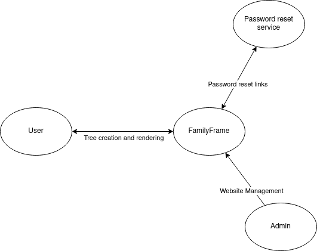
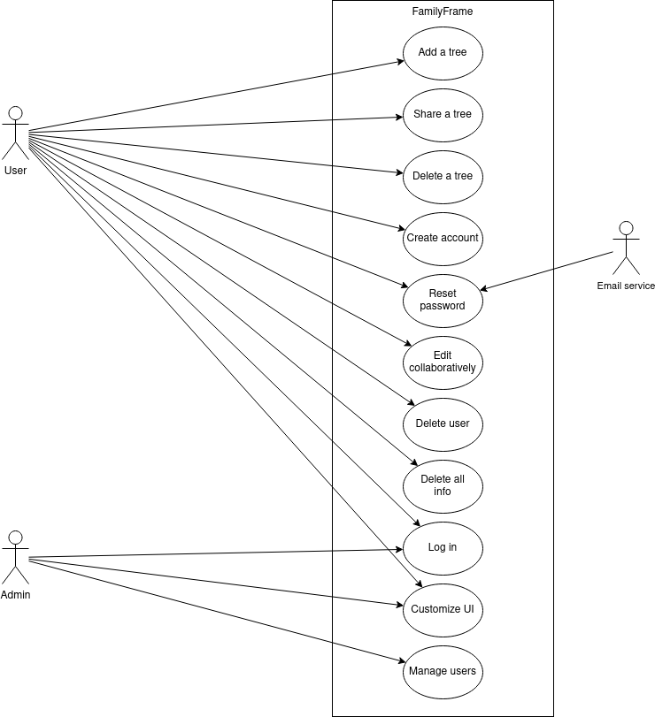
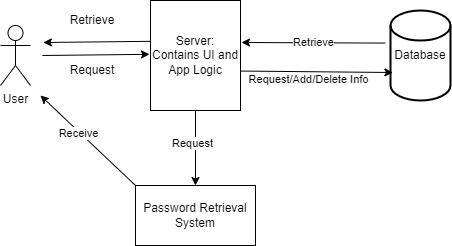

{width=10%}

# FamilyFrame

Dec 01, 2023

Version 1.0.0

**Presented To:**

Dr. Schwesinger

**Submitted By:**

Aidan La Penta

Amber Kulp

Palak Dilawari

Will Bechtel

REVISION HISTORY
----------------

| **Date** | **Author** | **Distributed to** | **Version** | **Description** |
| --- | --- | --- | --- | --- |
| Dec 01, 2023 | Aidan La Penta | Dr. Schwesinger | 1.0.0 | Creation |

\newpage

TABLE OF CONTENTS
-----------------
1. [Introduction](#1-introduction) ... 3
2. [Related Documents](#2-related-documents) ... 3
3. [Requirements](#3-requirements) ... 3
4. [Non-Functional Requirements](#4-non-functional-requirements) ... 5
5. [Architecture](#5-user-experience-wireframes) ... 6
6. [Signature Page](#6-signature-page) ... 7

\newpage

1 Introduction
--------------

The family tree website offers an extensive way to view a family's ancestry and relation, organize information about the family, and view it in a personalized way.​

Clients can consist of those looking to view their ancestry in an organized manner or want to share their familial connections to show others.

### 1.2 Scope

{width=50%}

{width=75%}

2 Related Documents
-------------------

[SDP](https://github.com/AmberRK/FamilyTree/blob/main/SDP.pdf)

[Wireframes](https://github.com/AmberRK/FamilyTree/blob/main/ImagesAndPdf/Wireframes.pdf)

[Requirements Matrix](https://livekutztown-my.sharepoint.com/:x:/g/personal/akulp740_live_kutztown_edu/EQ182g2-lzRKm2lrfiVhs1cB6wXmORwszVTD_afr5tJlDg)

3 Requirements
--------------

As someone with a large family I want to:

- Diagram my entire family
- Save my tree to view and edit later
- Share the diagram with my family
- Have my family help create my tree

As an admin of the site I want to:

- See a list of all users
- Delete user accounts if needed

### 3.1 Punch List

The following list are the items still to be resolved:

1. Password and database security
1. Reset password system

## Use Case Descriptions

### 3.1 Add a tree
Description:
A user can start a tree by adding members to the tree and entering their information. Members can be removed or edited. The user must sign in to save creations.

### 3.2 Share a tree
Description:
A user can share a tree to others. The other person does not have to be signed in to view a tree.

### 3.3 Delete a tree
Description:
A user can delete a tree that they have created from the website's database.

### 3.4 Create account
Description:
A new user can create an account to save trees and share trees with others.

### 3.5 Log in
Description:
A user with an account can login to access their saved trees.

### 3.6 Delete self
Description:
A user can delete their own account and choose to not delete trees that have collaborators.

### 3.7 Delete all info
Description:
A user can delete their own account and all trees they have created.

### 3.8 Customize UI
Description:
Users are able to modify the color scheme of the website.

### 3.9 Reset password
Description:
A user can reset account password to regain access to their account.

### 3.10 Collaborative editing 
Description:
Multiple users can simultaneously edit a tree.

### 3.11 Manage users
Description:
Admins can delete users and their associated trees.

4 Non Functional Requirements
---------

### 4.1 Other Systems

Forget password system.

### 4.2 Security

- HTTPS
- SSL CERT
- Encryption
- Encryption for passwords
- Protection against login injection

### 4.3 Performance

Uptime is dependent on the VPS and rented architecture.

Performance is also largely dependent on the rented hardware. Trees should save without interruption and be able to be loaded in one second.

### 4.4 Maintainability

Under the MIT license, maintenance is left to the community. Files with be available indefinitely. The service will be hosted while student credit lasts.

5 Architecture
--------------

{width=75%}

### 5.1 User
  - Requests information to the server
  - Receives information from the server

### 5.2 Server
  - Processes user requests
  - Request information from database
  - Receives information from database
  - Returns information to user

### 5.3 Database
  - Receives requests from server
  - Processes requests
  - Returns requested information to server
  
### 5.4 Password Retrieval System
  - Receives requests from server
  - Gives information to user

\newpage

Signature Page
--------------

AGREED TO:

Amber Kulp, Team Leader, 1 Dec 2023

Aidan La Penta, Team Member, 1 Dec 2023

Palak Dilawari, Team Member, 1 Dec 2023

Will Bechtel, Team Member, 1 Dec 2023
