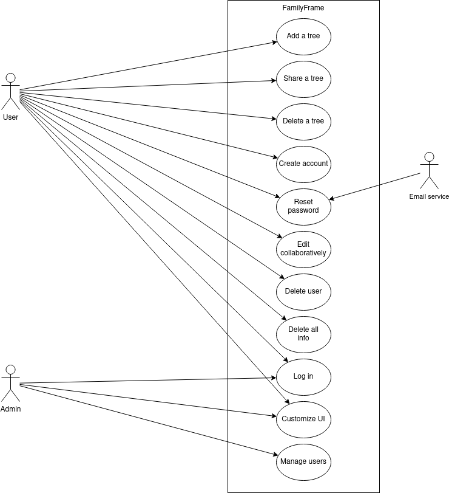
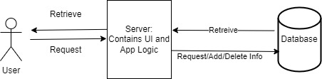

**NAME OF SYSTEM**

**DATE**

Version 1.0

**Logo**

**Presented To:**

**Name (client or class)**

**Submitted By:**

Group names
Aidan La Penta

TABLE OF CONTENTS
-----------------

REVISION HISTORY
----------------

| **Date** | **Author** | **Distributed to** | **Version** | **Description** |
| --- | --- | --- | --- | --- |
| Dec 01, 2023 | name | who | 1.0 | Creation |

1 Introduction
--------------

Brief explanation of project (from SDP)

Brief explanation of purpose and goal of this document

### 1.2 Scope

Context Diagram

Personas / Actors

{width=75%}

2 Related Documents
-------------------

Software Development Plan reference

Requirements Traceability matrix reference

Other diagrams references

3 Requirements
--------------

For each Actor, list all the user stories:

As an Actor1 I want to.....

-   Bulleted list

As an Actor2 I want to.....

-   Bulleted list

### 3.1 Punch List

The following list are the items still to be resolved:

1.  ......

## Use Case Descriptions

### 3.1 Add a tree
Description:
A user can start a tree by adding members to the tree and entering their information. Members can be removed or edited. The user must sign in to save creations.

### 3.2 Share a tree
Description:
A user can share a tree to others. The other person does not have to be signed in to view a tree.

### 3.3 Delete a tree
Description:
A user can delete a tree that they have created from the website's database.

### 3.4 Create account
Description:
A new user can create an account to save trees and share trees with others.

### 3.5 Log in
Description:
A user with an account can login to access their saved trees.

### 3.6 Delete self
Description:
A user can delete their own account and choose to not delete trees that have collaborators.

### 3.7 Delete all info
Description:
A user can delete their own account and all trees they have created.

### 3.8 Customize UI
Description:
Users are able to modify the color scheme of the website.

### 3.9 Reset password
Description:
A user can reset account password to regain access to their account.

### 3.10 Collaborative editing 
Description:
Multiple users can simultaneously edit a tree.

### 3.11 Manage users
Description:
Admins can delete users and their associated trees.

4 Non Functional Requirements
---------

### 4.1 Other Systems

describe.

### 4.2 Security

SSL cert?

### 4.3 Performance

Up time?

Response time?

### 4.4 Maintainability

How will it be maintained?

5 Architecture
--------------

### 5.1 USER
  - Requests information to the server
  - Receives information from the server

### 5.2 Server
  - Processes user requests
  - Request information from database
  - Receives information from database
  - Returns information to user

### 5.3 Database
  - Receives requests from server
  - Processes requests
  - Returns requested information to server
  

Signature Page
--------------

AGREED TO:

**Customer?**

**Signature**

**Name:**

**Title:**

**Date:**

AGREED TO:

**Team members**

**Signature**

**Name:**

**Title:**

**Date:**

---

Aidan La Penta

Team Member

1 Dec, 2023
